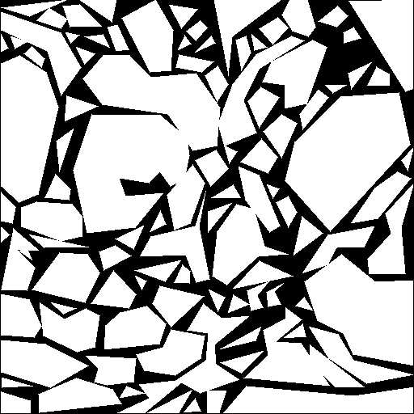
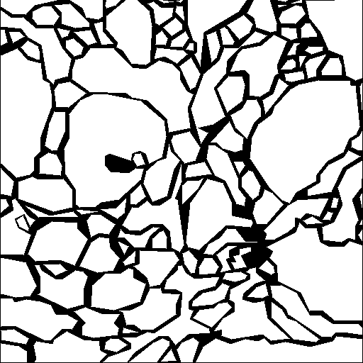
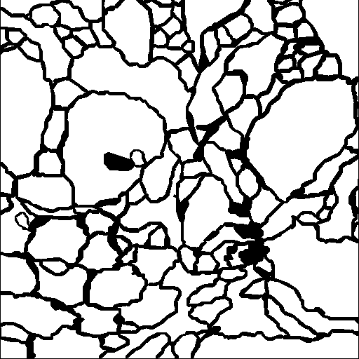
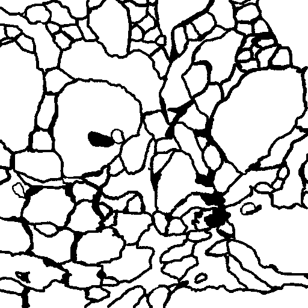

# Data Exchange with Reconstruct/Win 1.1.0.1

## How to use

Convert labels(png) to Reconstruct files (xml), e.g. using the SNEMI2D dataset:
```sh
python tools/process.py  --operation contours   --input_dir datasets/snemi2d/train_volume/  --output_dir temp/snemi2d_export/  --pixel_size  0.004  --section_thickness  0.050  --tolerance 10     --workers 4
```
Convert Reconstruct files (xml) to labels (png), e.g. on the converted file from SNEMI2D dataset:
```sh
python tools/process.py  --operation labels   --input_dir  temp/snemi2d_export/series  --output_dir  temp/snemi2d_import/  --workers 4
```  

Results:

|```--tolerance 10```|```--tolerance 3```|```--tolerance 1```|(original)|
|---|---|---|---|
| | | ||
|  32KB xml-file |  43KB xml-file | 70KB xml-file  |  14KB png-file   |

## Description
 
### To convert png to xml:

Under the assumption that images and label are organized in a folder structute like:

```
└── annotated_dataset
    ├── images
    │   ├── 1.png
    │   ├── 2.png
    │   ├── 3.png
    │   └── ...
    ├── dendrites
    │   ├── 1.png
    │   ├── 2.png
    │   └── ...
    ├── synapses
    └── ...
```
Convert the labels to contours by
```
python tools/process.py  --operation contours  \
   --input_dir annotated_dataset/images/ \
   --output_dir images_and_xml/ \
   --pixel_size  0.005 \
   --section_size  0.030 \
   --resolution  3  \
   --workers 4
```
where ```--pixel_size``` and ```--section_size``` are given in micrometers, while ```--resolution``` refers to the distance of the points in the contours (lower value will have finer contours and larger xml files): 

The converted dataset will be saved in a single folder:
```
└── annotated_dataset
    ├── 1.png
    ├── series.1
    ├── 2.png
    ├── series.2
    ├── 3.png
    ├── series.3
    ├── ...
    └── series.sec   # this file is not yet implmented
```
Note:
 - annotated image files are copied if ```--output_dir``` is different from ```--input_dir```
 - name of the contours is the name of the directory containing the label images
 - label images with same name correspond to same image file (ignored if they do not exist)
 - all subdirectories in the parent directory of ```--input_dir``` are assumed to contain label_images (again, if they do not contain labels, that is ignored)

### Convert contours to labels

Convert the contours to labels by
```
python tools/process.py  --operation contours  \
   --input_dir images_and_xml/series \
   --output_dir annotated_dataset/ \
   --workers 4
```
Note:
 - the prefix of the series files ```series``` must be contained in the path ```--input_dir``` 
